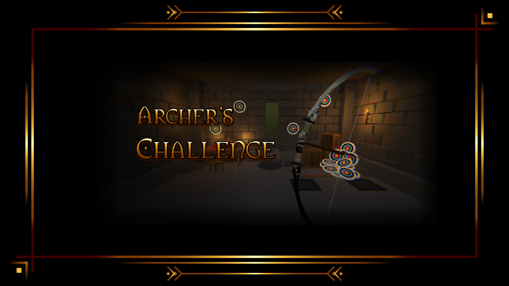
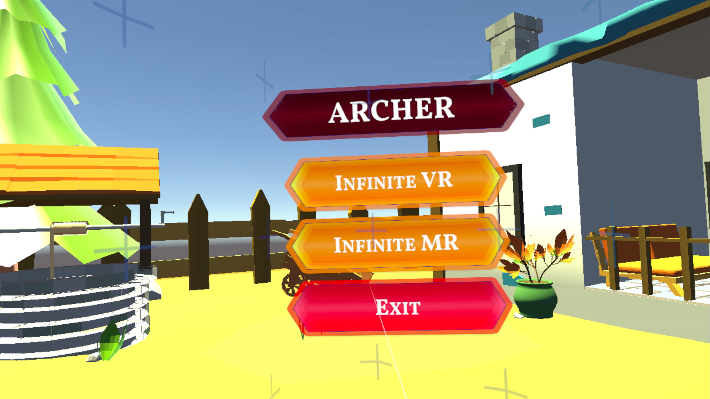
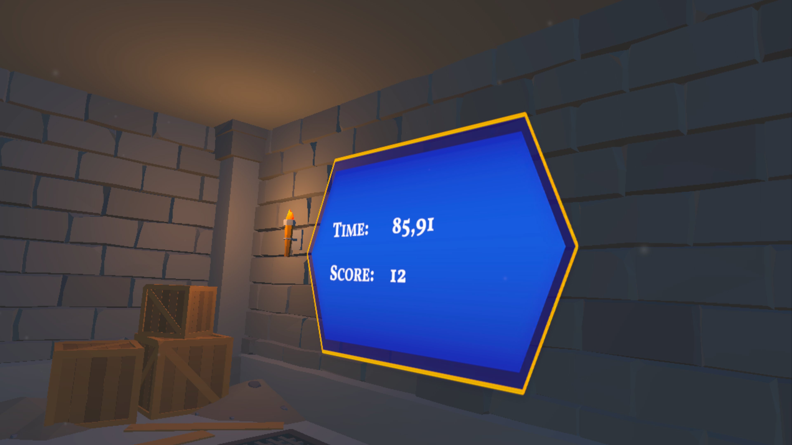
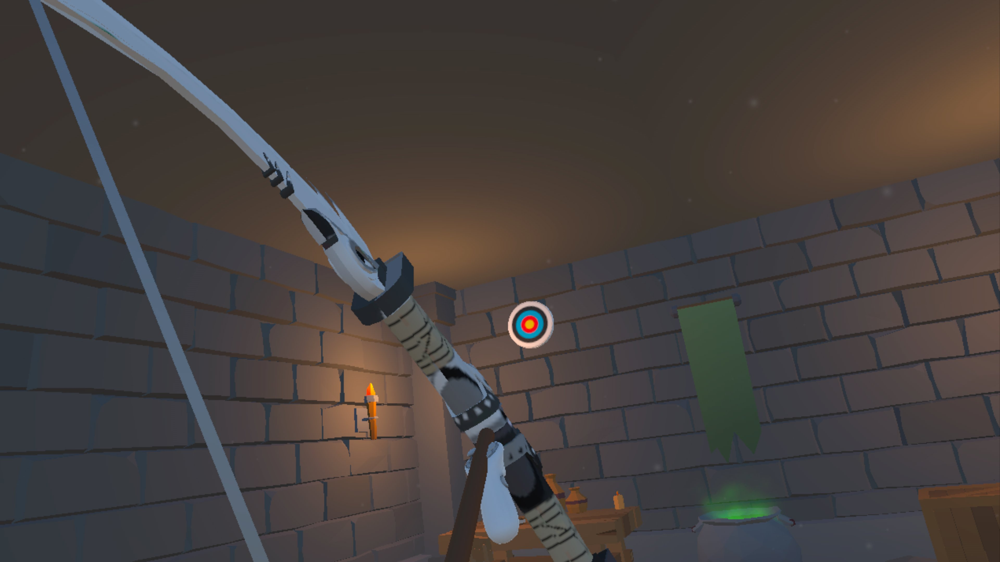
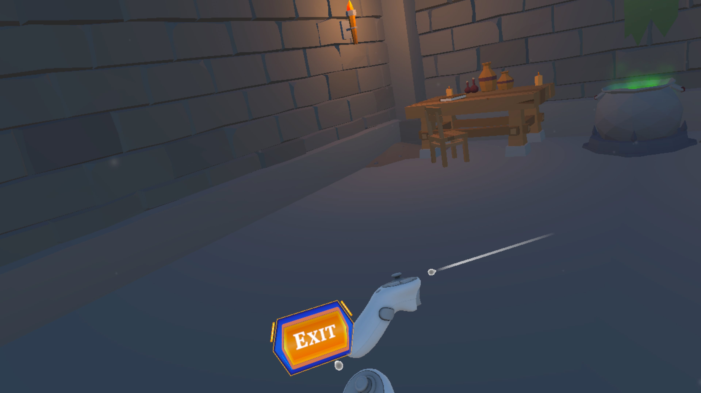
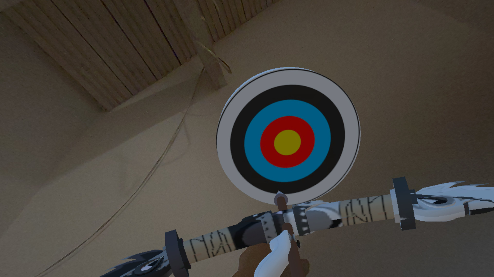

# Вызов лучника

[English](README.md) | [Русский](README.ru.md)

## Описание

Вызов лучника - это простая игра про стрельбу из лука по мишеням. Она является прототипом, демонстрирующим примитивный геймплей виртуальной реальности (VR) и смешанной реальности (MR). Игра написана на Unity и поддерживает платформы Windows (PCVR), Android (Oculus Quest).

В игре есть 2 бесконечных режима:

* Виртуальная реальность (VR) - игрок появляется в локации подземелья, на противоположной стене от игрока появляются мишени, и игрок должен найти их и поразить.

* Смешанная реальность (MR) - используется сквозная камера и отработка окружающего пространства, мишени появляются в случайных местах на границах пространства, и игрок должен найти их и поразить.

В игре присутствует главное меню в виде локации деревенского дома, где игрок может выбрать режим игры или выйти из игры.

### Примечание

В игре планировались система уровней как дополнительные режимы, магазин с различными скинами луков и стрел, а также система достижений. Различные режимы уровней (на время, на точность, на количество мишеней и т.д.) и различные типы мишеней (статичные, движущиеся, телепортирующиеся и т.д.). Но из-за ограниченности времени и ресурсов, эти функции не были реализованы, но в проекте остались некоторые заготовки и наработки.

#### Проект доработан до стадии прототипа и не планируется дальнейшая разработка

## Скачать

Игру можно скачать со следующих ресурсов:

* [GitHub release](https://github.com/ShutovKS/Archers-challenge/releases)
* [Itch.io](https://shutovks.itch.io/archers-challenge)
* [SideQuest](https://sidequestvr.com/app/37198/archers-challenge)

## Автор

* **Кирилл Шутов** (ShutovKS), Russia - [GitHub](https://github.com/ShutovKS/)

## Скриншоты

## Лицензия

Этот проект лицензирован под лицензией MIT - см. файл [LICENSE](LICENSE) для получения дополнительной информации.
